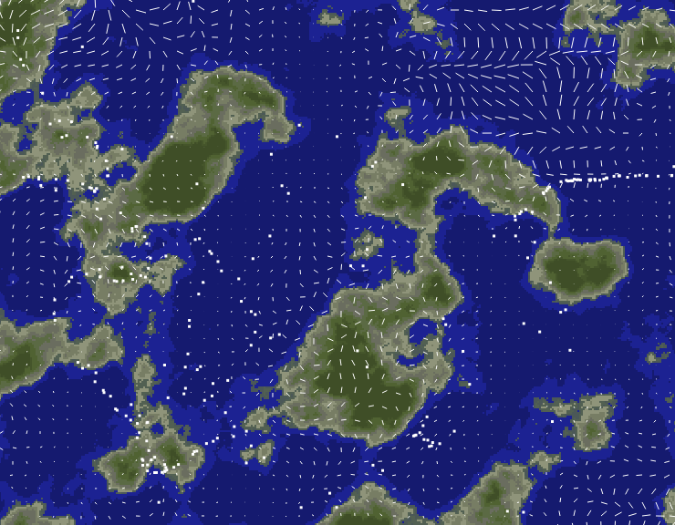

# perlin-noise-worldmap

Using Perlin Noise to generate a worldmap and move dots.

[Demo](http://tokyo800.jp/minagawah/perlin-noise-worldmap/)

Based on [Johan Karlsson's blog post](https://codepen.io/DonKarlssonSan/post/particles-in-simplex-noise-flow-field)
 
## License

Vector library:  
MIT License  
Copyright (c) 2011 Max Kueng, George Crabtree

Perlin nose generation:
ISC License  
Copyright (c) 2013, Joseph Gentle

See [LICENSE](./LICENSE) for details.

